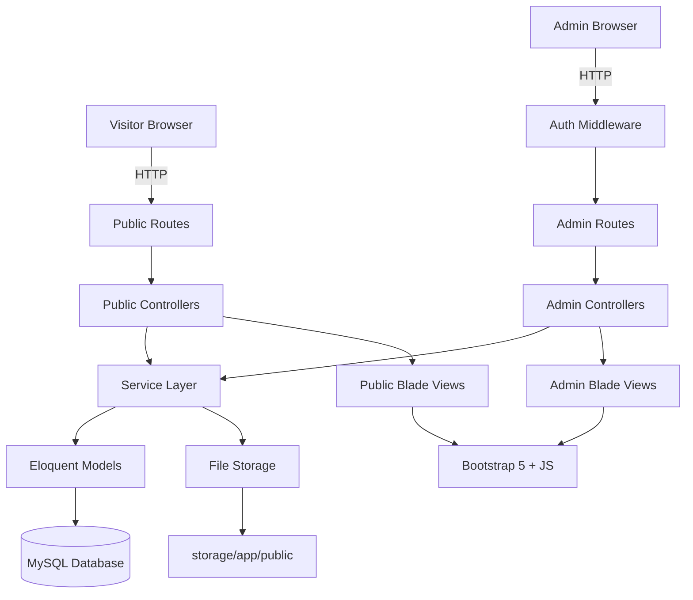
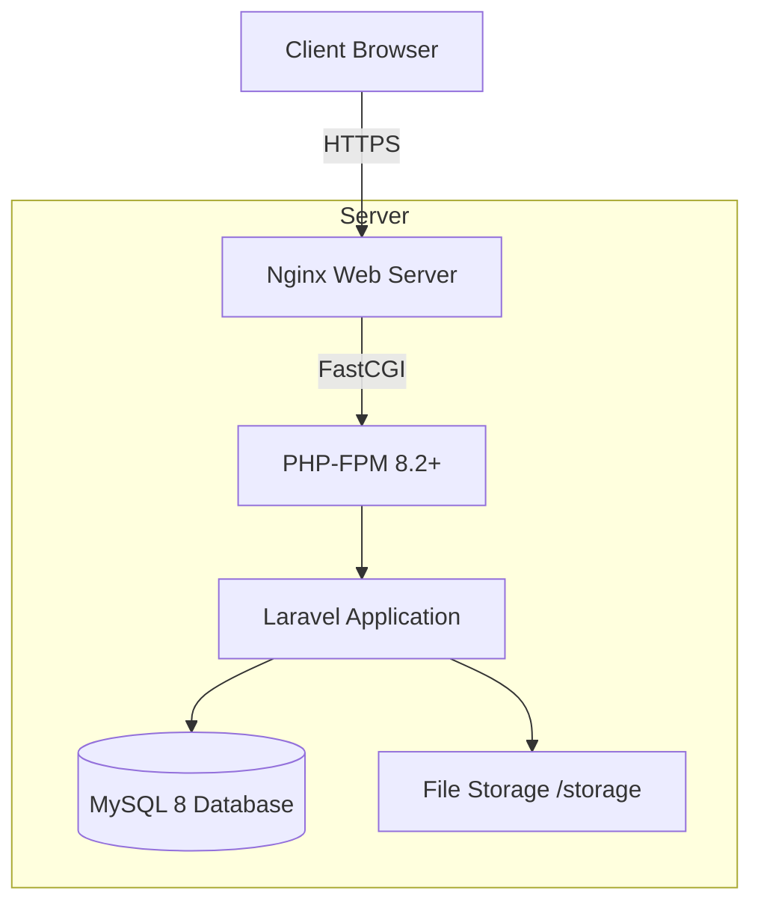

# High-Level Design (HLD)

## Project: BSK Photography Portfolio Website

---

## 1. System Overview

The BSK Photography Portfolio Website is a Laravel-based monolithic web application consisting of:

- **Public Frontend**: Bootstrap-powered responsive website for visitors
- **Admin Panel**: Full CMS backend for the photographer to manage all content
- **Database Layer**: MySQL relational database storing all structured data
- **File Storage**: Laravel filesystem for image uploads

---

## 2. Architecture Diagram

---

## 3. Major Modules

| Module | Description |
|--------|-------------|
| Authentication | Admin login/logout using Laravel Auth |
| Dashboard | Statistics overview and quick navigation |
| Category Management | CRUD operations for photography categories |
| Portfolio Management | Image upload, categorization, and gallery management |
| Events | Event creation with photo galleries |
| Services | Photography service listings with pricing |
| About Us | Photographer bio and story management |
| Contact Us | Inquiry form with email notifications |
| Social Media | Social link management |
| CMS | Banners, dynamic content, site settings |
| Testimonials | Client testimonial management |
| Blog | Blog post creation and display |

---

## 4. Application Architecture

### 4.1 Frontend Architecture
- **Template Engine**: Laravel Blade
- **CSS Framework**: Bootstrap 5
- **JavaScript**: Vanilla JS + libraries (Lightbox2, Swiper.js for sliders)
- **Layout**: Master layout with sections (header, footer, sidebar for admin)
- **Responsive**: Mobile-first responsive design

### 4.2 Backend Architecture
- **Framework**: Laravel 11
- **Pattern**: MVC (Model - View - Controller)
- **Middleware**: Authentication, CSRF protection
- **Route Groups**: Public routes, Admin routes (auth-protected)
- **File Upload**: Laravel Storage with public disk

### 4.3 Database Architecture
- **RDBMS**: MySQL 8
- **ORM**: Eloquent
- **Migrations**: Laravel schema migrations
- **Seeders**: Default admin user and initial data

---

## 5. API / Route Interactions

### Public Routes (No Auth Required)
| Route | Controller | Description |
|-------|-----------|-------------|
| GET / | HomeController | Homepage with banners, featured portfolio, testimonials |
| GET /portfolio | PortfolioController | Gallery with category filter |
| GET /portfolio/{slug} | PortfolioController | Category-specific gallery |
| GET /services | ServiceController | Services listing |
| GET /events | EventController | Events listing |
| GET /events/{slug} | EventController | Event gallery view |
| GET /about | AboutController | About the photographer |
| GET /contact | ContactController | Contact form |
| POST /contact | ContactController | Submit inquiry |
| GET /blog | BlogController | Blog listing |
| GET /blog/{slug} | BlogController | Blog post detail |

### Admin Routes (Auth Required, prefix: /admin)
| Route | Controller | Description |
|-------|-----------|-------------|
| GET /admin/dashboard | DashboardController | Admin dashboard |
| RESOURCE /admin/categories | CategoryController | Category CRUD |
| RESOURCE /admin/portfolio | PortfolioController | Portfolio CRUD |
| RESOURCE /admin/events | EventController | Event CRUD |
| RESOURCE /admin/services | ServiceController | Service CRUD |
| GET/POST /admin/about | AboutController | About page management |
| RESOURCE /admin/testimonials | TestimonialController | Testimonials CRUD |
| RESOURCE /admin/blog | BlogController | Blog CRUD |
| GET /admin/inquiries | InquiryController | View inquiries |
| RESOURCE /admin/social-links | SocialLinkController | Social media CRUD |
| RESOURCE /admin/banners | BannerController | Banner/slider CRUD |
| GET/POST /admin/settings | SettingController | Site settings |

---

## 6. Deployment Architecture

### Deployment Components
- **Web Server**: Nginx with PHP-FPM
- **PHP**: PHP 8.2+
- **Application**: Laravel 11
- **Database**: MySQL 8
- **Storage**: Local filesystem with symlink (php artisan storage:link)
- **Queue**: Laravel Queue for email sending (optional: Redis/database driver)

---

## 7. Security Architecture

- CSRF protection on all forms
- Session-based authentication for admin
- Input validation and sanitization on all forms
- XSS protection via Blade auto-escaping
- SQL injection prevention via Eloquent ORM
- Rate limiting on contact form submissions
- Secure file upload validation (image types only, size limits)
- Right-click/download protection on portfolio images (JavaScript)
