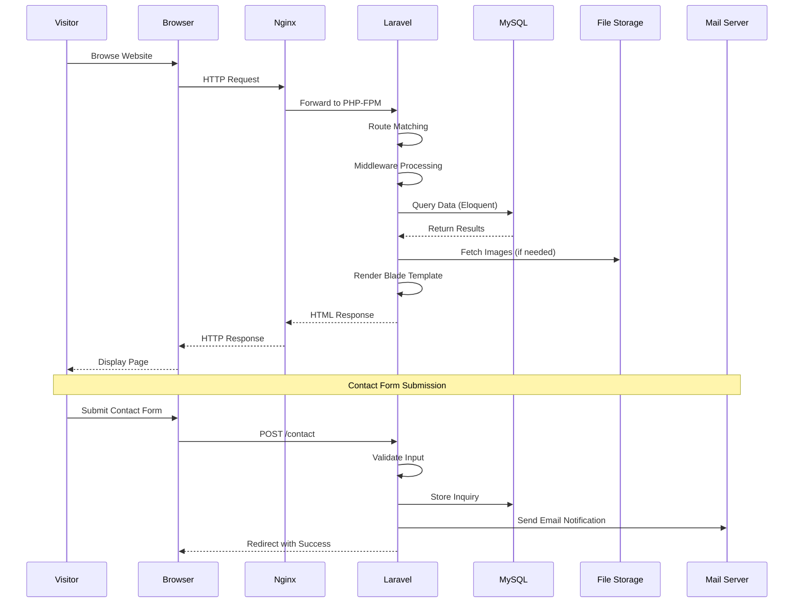
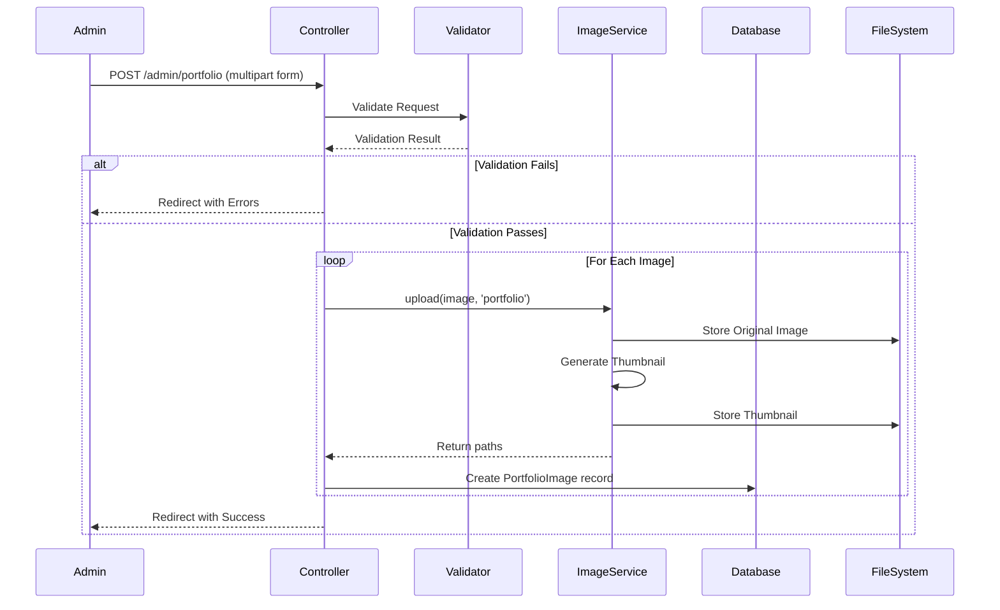
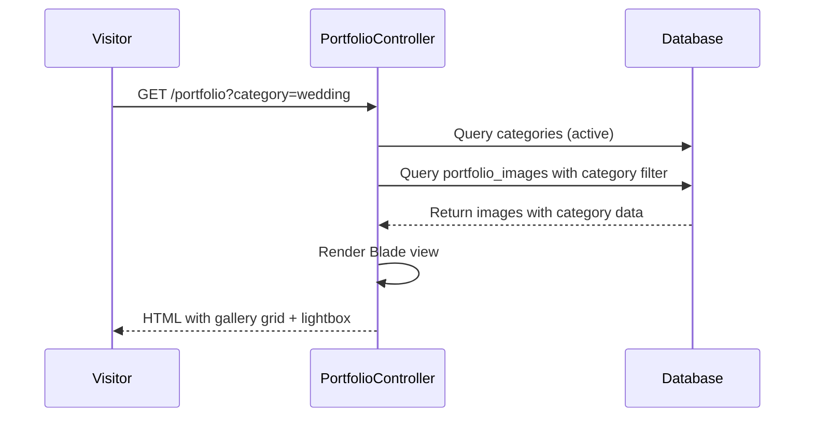

# Technical Design Specification (TDS)

## Project: BSK Photography Portfolio Website

---

## 1. Component Interactions



---

## 2. Configuration Requirements

### 2.1 Application Configuration (`.env`)
```
APP_NAME="BSK Photography"
APP_ENV=production
APP_KEY=base64:generated-key
APP_DEBUG=false
APP_URL=https://bskphotography.com

DB_CONNECTION=mysql
DB_HOST=127.0.0.1
DB_PORT=3306
DB_DATABASE=bsk_photography
DB_USERNAME=root
DB_PASSWORD=secure-password

MAIL_MAILER=smtp
MAIL_HOST=smtp.gmail.com
MAIL_PORT=587
MAIL_USERNAME=email@gmail.com
MAIL_PASSWORD=app-password
MAIL_ENCRYPTION=tls
MAIL_FROM_ADDRESS=noreply@bskphotography.com
MAIL_FROM_NAME="BSK Photography"

FILESYSTEM_DISK=public
```

### 2.2 File Upload Configuration
```php
// config/filesystems.php → public disk
'public' => [
    'driver' => 'local',
    'root' => storage_path('app/public'),
    'url' => env('APP_URL').'/storage',
    'visibility' => 'public',
],
```

### 2.3 Image Upload Directories
```
storage/app/public/
├── categories/
├── portfolio/
├── portfolio/thumbnails/
├── events/
├── services/
├── banners/
├── testimonials/
├── blog/
├── about/
└── settings/
```

---

## 3. Error Handling Strategy

### 3.1 Global Exception Handler
- All exceptions handled via Laravel's exception handler
- Custom error pages for 404, 403, 500
- Validation errors returned with old input to forms

### 3.2 Form Validation
- Server-side validation using Laravel Form Requests
- Client-side validation using HTML5 attributes + JavaScript
- Flash messages for success/error feedback

### 3.3 Image Upload Errors
- File type validation (jpeg, png, jpg, webp only)
- File size limits (2MB for covers, 5MB for portfolio)
- Graceful handling if storage is full

### 3.4 Email Errors
- Queue email sending to prevent blocking
- Log failures for later retry
- Don't show email errors to frontend visitors

---

## 4. Sequence Flows

### 4.1 Admin Image Upload Flow


### 4.2 Public Gallery View Flow


---

## 5. Integration Points

### 5.1 Email Integration
- **Service**: Laravel Mail with SMTP
- **Trigger**: New contact inquiry submission
- **Template**: Mailable class `NewInquiryMail`
- **Queue**: Dispatch via database queue driver

### 5.2 File Storage Integration  
- **Driver**: Local filesystem (public disk)
- **Symlink**: `php artisan storage:link` (maps storage/app/public → public/storage)
- **Access**: Via `/storage/` URL prefix

### 5.3 Frontend Libraries (CDN)
| Library | Purpose | Version |
|---------|---------|---------|
| Bootstrap 5 | CSS/JS Framework | 5.3.x |
| Bootstrap Icons | Icon set | 1.11.x |
| Lightbox2 | Image lightbox | 2.11.x |
| Swiper.js | Image slider/carousel | 11.x |
| AOS | Animate on scroll | 2.3.x |
| TinyMCE | Rich text editor (admin) | 6.x |

---

## 6. Directory Structure

```
BSK_photography/
├── app/
│   ├── Http/
│   │   ├── Controllers/
│   │   │   ├── Admin/
│   │   │   │   ├── DashboardController.php
│   │   │   │   ├── CategoryController.php
│   │   │   │   ├── PortfolioController.php
│   │   │   │   ├── EventController.php
│   │   │   │   ├── ServiceController.php
│   │   │   │   ├── AboutController.php
│   │   │   │   ├── TestimonialController.php
│   │   │   │   ├── BlogController.php
│   │   │   │   ├── InquiryController.php
│   │   │   │   ├── SocialLinkController.php
│   │   │   │   ├── BannerController.php
│   │   │   │   └── SettingController.php
│   │   │   ├── HomeController.php
│   │   │   ├── PortfolioController.php
│   │   │   ├── ServiceController.php
│   │   │   ├── EventController.php
│   │   │   ├── AboutController.php
│   │   │   ├── ContactController.php
│   │   │   └── BlogController.php
│   │   └── Middleware/
│   ├── Models/
│   │   ├── User.php
│   │   ├── Category.php
│   │   ├── PortfolioImage.php
│   │   ├── Event.php
│   │   ├── EventImage.php
│   │   ├── Service.php
│   │   ├── About.php
│   │   ├── ContactInquiry.php
│   │   ├── SocialLink.php
│   │   ├── Banner.php
│   │   ├── Setting.php
│   │   ├── Testimonial.php
│   │   └── BlogPost.php
│   ├── Mail/
│   │   └── NewInquiryMail.php
│   ├── Services/
│   │   ├── ImageService.php
│   │   └── SettingService.php
│   └── Providers/
├── config/
├── database/
│   ├── migrations/
│   └── seeders/
├── public/
│   ├── css/
│   ├── js/
│   └── images/
├── resources/
│   └── views/
│       ├── layouts/
│       │   ├── app.blade.php (public layout)
│       │   └── admin.blade.php (admin layout)
│       ├── public/
│       │   ├── home.blade.php
│       │   ├── portfolio.blade.php
│       │   ├── services.blade.php
│       │   ├── events.blade.php
│       │   ├── event-detail.blade.php
│       │   ├── about.blade.php
│       │   ├── contact.blade.php
│       │   ├── blog.blade.php
│       │   └── blog-detail.blade.php
│       ├── admin/
│       │   ├── dashboard.blade.php
│       │   ├── categories/
│       │   ├── portfolio/
│       │   ├── events/
│       │   ├── services/
│       │   ├── about/
│       │   ├── testimonials/
│       │   ├── blog/
│       │   ├── inquiries/
│       │   ├── social-links/
│       │   ├── banners/
│       │   └── settings/
│       ├── auth/
│       │   └── login.blade.php
│       ├── partials/
│       │   ├── header.blade.php
│       │   ├── footer.blade.php
│       │   └── admin-sidebar.blade.php
│       └── errors/
│           ├── 404.blade.php
│           └── 500.blade.php
├── routes/
│   └── web.php
├── storage/
├── docs/
└── .env
```

---

## 7. Performance Optimization

- Image thumbnail generation on upload
- Lazy loading for gallery images (`loading="lazy"`)
- Browser caching headers for static assets
- Database indexing on slug columns and foreign keys
- Eager loading of relationships to prevent N+1 queries
- CSS/JS minification for production
